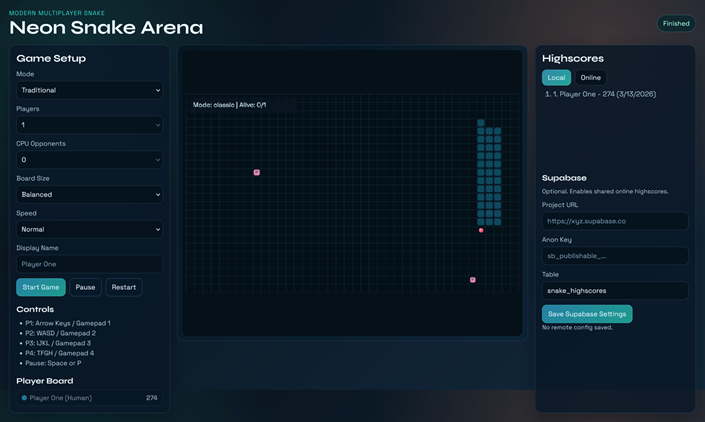

# Neon Snake Arena

A modern, responsive Snake game built with vanilla HTML/CSS/JS, featuring:

- Traditional single-player mode
- Versus mode (human vs human, human vs CPU, or mixed) with up to 4 players
- Power-ups (speed burst, x2 points, shield, freeze rivals, phase walk)
- Local highscores (always available)
- Online highscores via Supabase (optional)
- Keyboard, touch, and controller support
- Widescreen desktop support + mobile-friendly layout
- Netlify-ready static hosting

## Project Structure

- `index.html` - app shell + UI
- `styles.css` - responsive modern styling
- `config.js` - runtime config defaults for Supabase
- `src/app.js` - game engine + UI + highscore services
- `netlify.toml` - Netlify configuration

## Quick Start

This is a static site. You can run it with any local static server.

Example with Node:

```bash
npx serve .
```

Then open the local URL printed by your server.

## Controls

### Keyboard

- Player 1: Arrow keys
- Player 2: `W A S D`
- Player 3: `I J K L`
- Player 4: `T F G H`
- Pause / Resume: `Space` or `P`

### Touch (mobile)

- Use the on-screen direction pad under the board.

### Controller (Gamepad API)

- Supports up to 4 connected controllers
- Uses D-pad or left stick per assigned human player slot

## Modes

### Traditional

- Classic single-player Snake.

### Versus

- 2 to 4 players
- Set number of CPU opponents (always keeps at least 1 human slot)

## Power-Ups

- `Speed Burst` - temporary movement speed increase
- `x2 Points` - doubles points for food and power-up bonuses while active
- `Shield` - blocks one lethal collision
- `Freeze Rivals` - temporarily slows other living snakes
- `Phase Walk` - pass through walls/body collisions temporarily

## Highscores

### Local Highscores

Saved automatically in browser `localStorage` by mode (`classic` / `versus`).

### Online Highscores (Supabase)

1. Create a Supabase project.
2. Create a table (default expected name: `snake_highscores`).
3. Paste your project URL and anon key into the in-game Supabase panel.
4. Save settings.

Suggested SQL:

```sql
create table if not exists public.snake_highscores (
  id uuid primary key default gen_random_uuid(),
  name text not null,
  score integer not null,
  mode text not null check (mode in ('classic', 'versus')),
  metadata jsonb not null default '{}'::jsonb,
  created_at timestamptz not null default now()
);

alter table public.snake_highscores enable row level security;

create policy "Public read highscores"
on public.snake_highscores
for select
using (true);

create policy "Public insert highscores"
on public.snake_highscores
for insert
with check (true);
```

## Netlify Deployment

This repo is static and includes `netlify.toml`.

Deploy options:

1. Connect repo to Netlify and deploy directly.
2. Or drag-and-drop this folder in Netlify Deploys.

No build command is required.

## Configuration

`config.js` can define default Supabase values:

```js
window.SNAKE_CONFIG = {
  supabaseUrl: "",
  supabaseAnonKey: "",
  highscoresTable: "snake_highscores"
};
```

The in-app Supabase form saves values to browser local storage.

## Notes

- Online score save/load requires network access from the browser and valid Supabase RLS policies.
- If Supabase is not configured, the game still works fully with local highscores.
